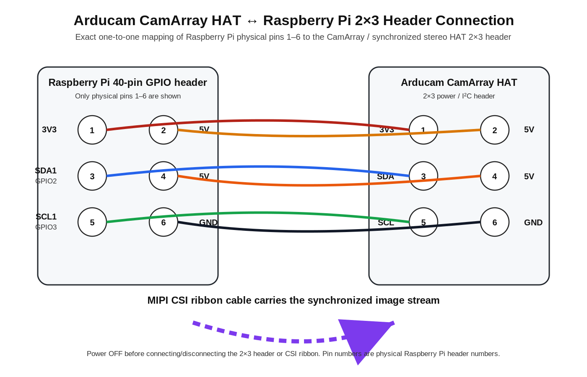

# 1. Hardware Wiring

## Components

The project camera subsystem uses:

- Raspberry Pi 4 or Raspberry Pi Compute Module 4 carrier exposing a Raspberry Pi-compatible GPIO header
- Arducam synchronized stereo / CamArray HAT
- two synchronized monochrome cameras
- MIPI CSI ribbon between the HAT and Raspberry Pi camera interface
- 2x3 header cable between the Raspberry Pi's first six physical GPIO pins and the HAT

## 2x3 CamArray header connection



Arducam's synchronized stereo HAT datasheet defines the 2x3 header as:

| HAT pin | Signal | Type | Raspberry Pi physical pin |
|---:|---|---|---:|
| 1 | 3V3 | Power | 1 |
| 2 | 5V | Power | 2 |
| 3 | SDA | I/O | 3 |
| 4 | 5V | Power | 4 |
| 5 | SCL | I/O | 5 |
| 6 | GND | Ground | 6 |

On a standard Raspberry Pi GPIO header, physical pins 3 and 5 correspond to GPIO2/SDA1 and GPIO3/SCL1 respectively.

### Important orientation rule

Do not determine pin 1 by cable colour or by visual similarity between different carrier boards. Identify the Raspberry Pi header's **physical pin 1** first, then connect the 2x3 header one-to-one.

## CSI connection

The HAT also connects to a Raspberry Pi CSI camera port. This connection carries the image data.

- Raspberry Pi 4 uses the classic 15-pin camera connector.
- Compute Module carrier boards commonly expose a 22-pin camera connector.
- Use the appropriate 15-pin/22-pin cable for the specific board and HAT revision.

Always power the board off before inserting or removing CSI ribbon cables.

## What the two connections do

Conceptually:

```text
Monochrome camera A ─┐
                     ├─> CamArray / synchronized stereo HAT ──MIPI CSI──> Raspberry Pi
Monochrome camera B ─┘                    │
                                          └─2x3 header: power + SDA/SCL control
```

The project treats the stereo kit as one synchronized combined camera stream.
